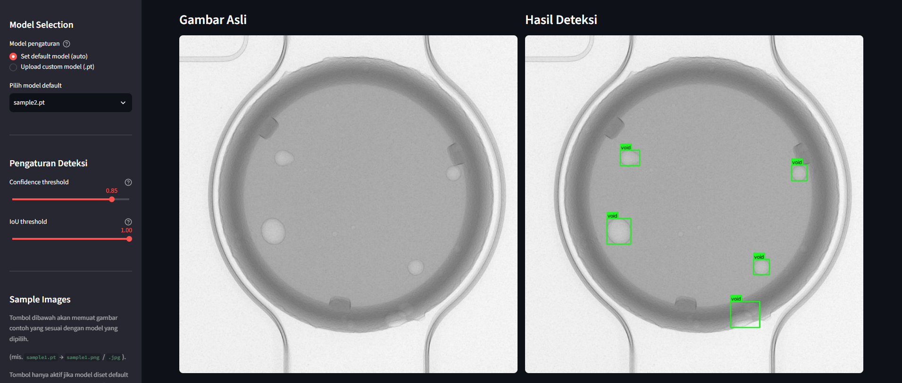

# Industrial X-Ray Defect Judgment System — AI Inspection PoC

A Streamlit-based web application demonstrating an **automated 2D X-Ray quality inspection pipeline** powered by **YOLO (Ultralytics)** and **PyTorch**. Designed to detect internal defects (such as void defects) in industrial manufacturing components.

> **Disclaimer / NDA Notice:**  
> This repository serves as a Proof-of-Concept (PoC) demonstration for portfolio purposes. To strictly comply with Non-Disclosure Agreements (NDA) and protect client intellectual property, all proprietary industrial X-ray imagery and client-trained model weights have been replaced with open-source sample datasets and dummy models.

---

## 📸 Demo Preview



### 🌐 Live Interactive Demo
<p>
  <a href="https://davidinations-yolo.streamlit.app/" target="_blank">
    <strong>👉 Open YOLO X-Ray Inspection Streamlit App</strong>
  </a>
</p>

*Note: Hosted on Streamlit Community Cloud (free tier). If the application is in sleep mode, please allow ~60 seconds for the server to wake up.*

---

## Key Features

- **Model Selection & Custom Upload:**
  - Auto-loads pre-configured lightweight default models (`.pt`) from the `models/` directory.
  - Supports custom model uploads directly via the UI.
- **Automated Sample Testing:**
  - One-click testing using pre-loaded X-ray test images matching specific default model targets.
- **Real-Time Confidence & IoU Tuning:**
  - Interactive sidebar sliders to dynamically tweak detection sensitivity (Confidence) and Non-Maximum Suppression thresholds (IoU).
- **Side-by-Side Visual Inspection:**
  - Displays original scan image alongside the annotated AI bounding-box detection output.
- **Defect Metrics Summary Table:**
  - Itemized table showing detected defect classes, confidence scores, bounding box coordinates, and per-class total counts.

---

## Technical Stack

- **Computer Vision & AI:** Ultralytics YOLOv11 / YOLOv8, PyTorch, OpenCV
- **Data & Metrics Processing:** NumPy, Pandas
- **Frontend / Deployment:** Streamlit, Streamlit Community Cloud

---

## Getting started

### Install

```bash
pip install -r requirements.txt
```

### Add a default model

Place one or more `.pt` model files into the `models/` folder:

```text
models/
  best.pt
  my_model.pt
```

They will appear in the "default model" dropdown automatically. Without any
model in `models/`, you can still upload a model file from the UI.

> Model weights are **not committed** to git. Add `models/*.pt` to your
> `.gitignore` if using git.

### Run locally

```bash
streamlit run app.py
```

### Deploy to Streamlit Community Cloud

1. Push the repository to GitHub.
2. Enable Streamlit Community Cloud on the repo.
3. Streamlit reads `requirements.txt` automatically — no build step.

## Configuration defaults

The default confidence and IoU values match the original Flask template's
`.env`:

| Parameter            | Default |
| -------------------- | ------- |
| Confidence threshold | 0.8     |
| IoU threshold        | 0.9     |

Both are adjustable via sliders in the app's sidebar.

## Project layout

```text
app.py            # Streamlit application
requirements.txt  # Pinned dependencies
models/           # Optional default .pt model(s)
test_images/      # Optional sample test images matched by model name
README.md         # This file
```
